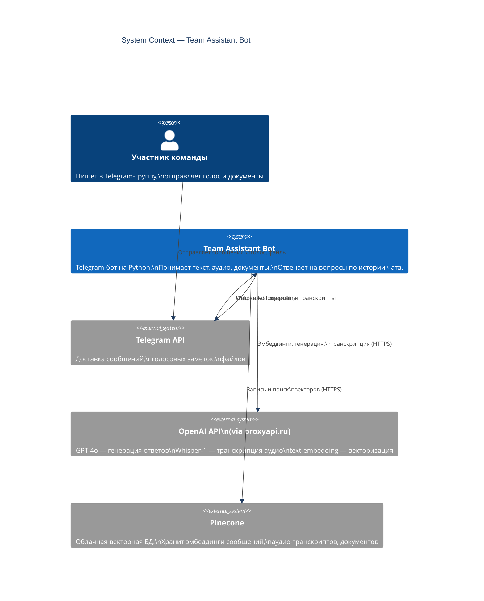
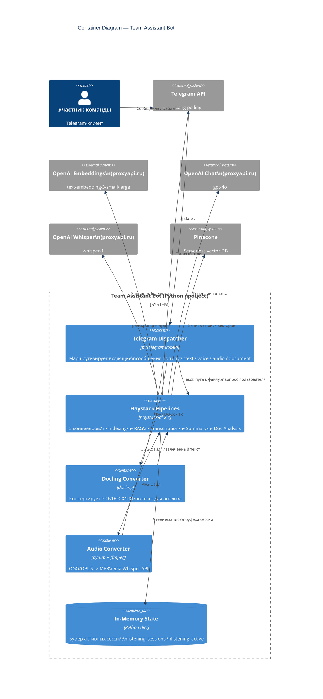
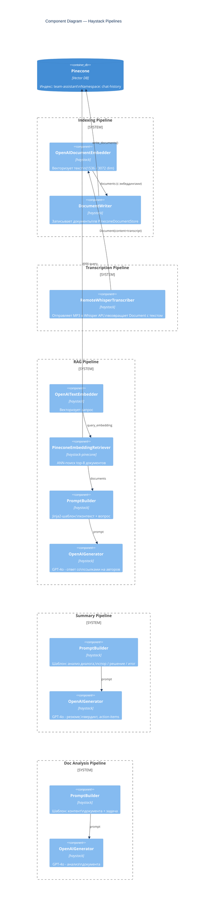
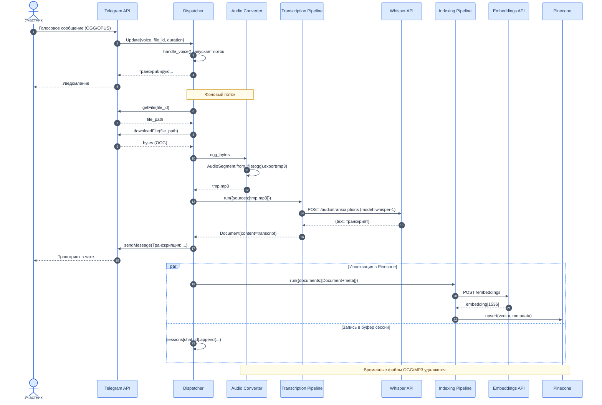
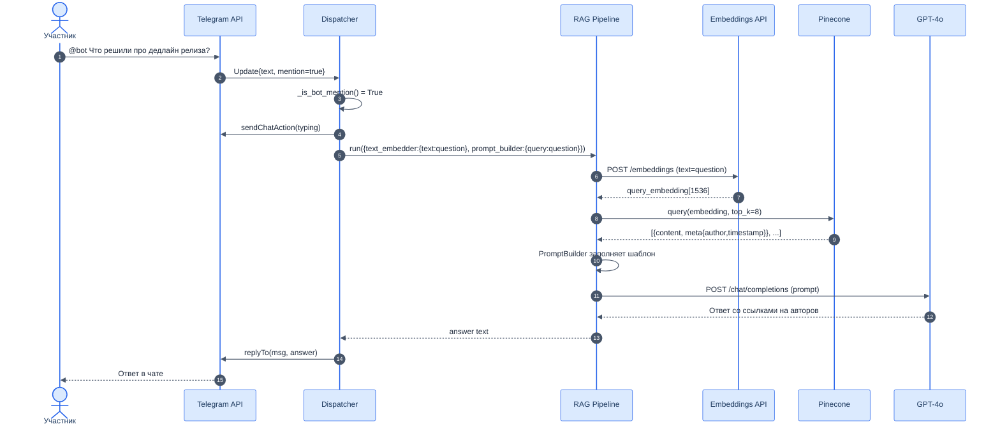
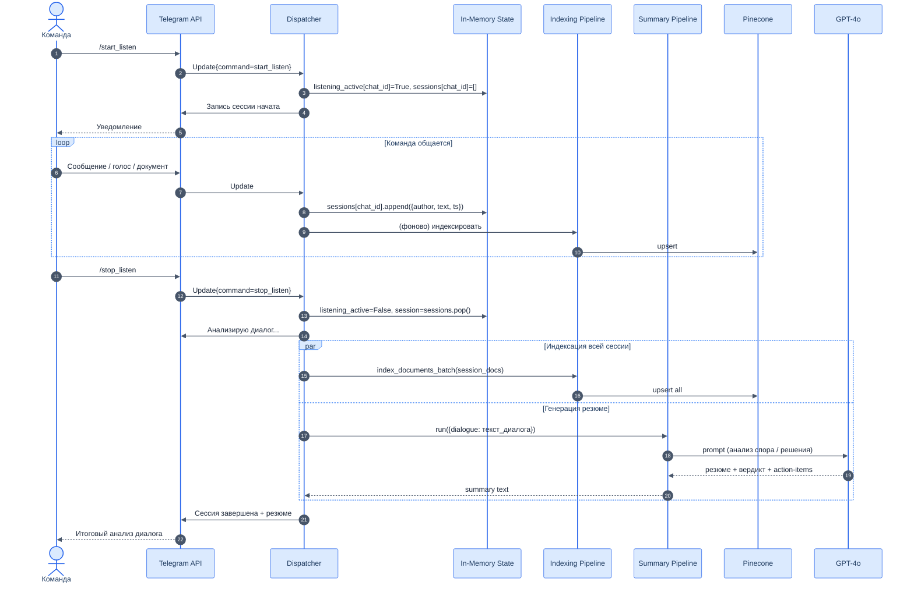
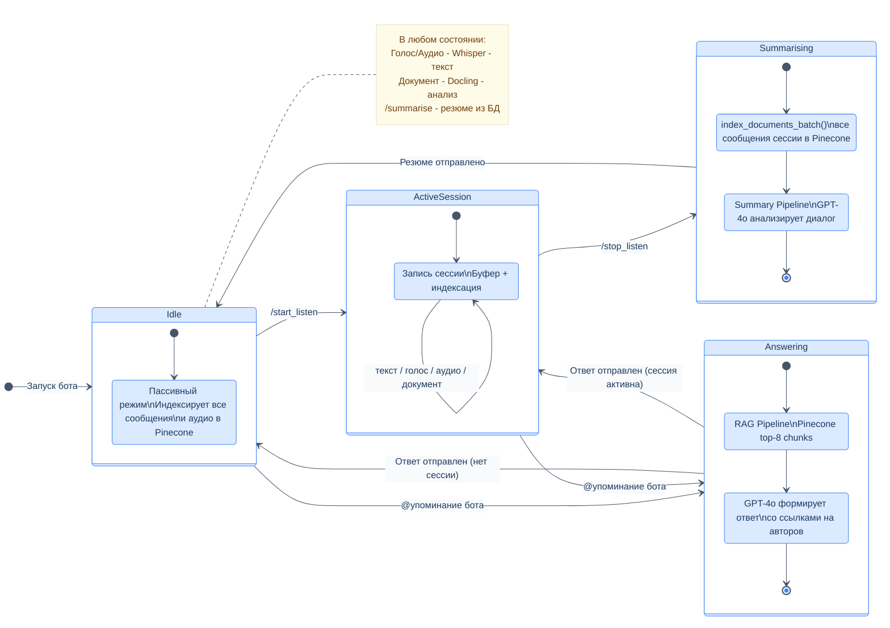
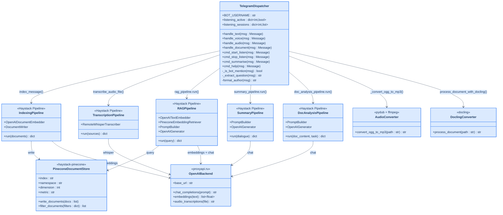
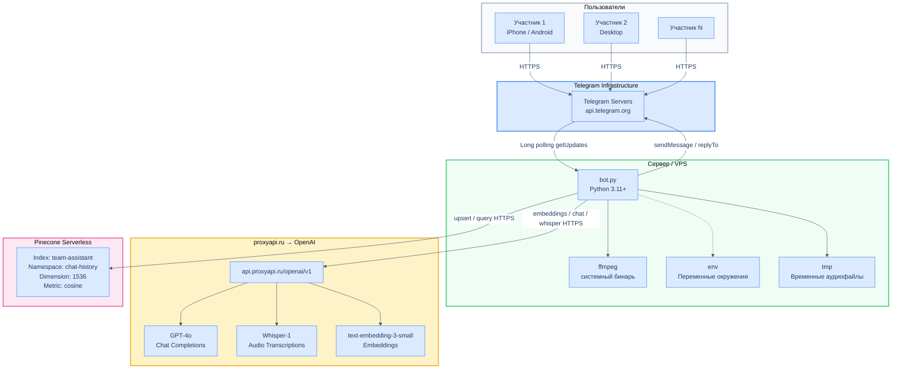

# 🤖 Team Assistant Telegram Bot

Умный командный Telegram-бот на базе **Haystack 2.x**, **Pinecone** и **OpenAI** (через [proxyapi.ru](https://proxyapi.ru)).  
Понимает текст, голосовые сообщения и документы. Сохраняет всю историю команды в векторную БД, умеет резюмировать обсуждения и отвечать на вопросы по контексту переписки.

---

## Возможности

| Функция | Описание |
|---|---|
| 📡 Пассивное слушание | Каждое текстовое сообщение автоматически индексируется в Pinecone |
| 🎙 Голосовые сообщения | Транскрибация через Whisper → индексация текста |
| 🎵 Аудиофайлы | MP3, WAV, M4A, OGG, WebM → Whisper → текст → Pinecone |
| 🟢 `/start_listen` | Начать активную запись сессии обсуждения |
| 🔴 `/stop_listen` | Завершить сессию → резюме + вердикт от ИИ |
| 💬 Упоминание `@team_assistant_text_audio_bot` | RAG-ответ на вопрос по всей истории чата |
| 📄 Документы | Анализ PDF / DOCX / TXT через Docling |
| 📊 `/summarise` | Глобальное резюме чата из векторной БД |

---

## Быстрый старт

### 1. Клонируй и настрой окружение

```bash
git clone <repo>
cd <repo>
python -m venv .venv
source .venv/bin/activate        # Windows: .venv\Scripts\activate
pip install -r requirements.txt
```

> **Для аудио** дополнительно нужен системный `ffmpeg`:
> ```bash
> apt install ffmpeg       # Ubuntu / Debian
> brew install ffmpeg      # macOS
> # Windows — скачать с https://ffmpeg.org/download.html и добавить в PATH
> ```

### 2. Создай `.env`

```bash
cp .env.example .env
# Заполни значения в .env
```

### 3. Переменные окружения

| Переменная | Обязательна | Описание |
|---|:---:|---|
| `TELEGRAM_BOT_TOKEN` | ✅ | Токен бота от [@BotFather](https://t.me/BotFather) |
| `PINECONE_API_KEY` | ✅ | API-ключ [Pinecone](https://console.pinecone.io) |
| `PINECONE_INDEX_NAME` | — | Имя индекса (default: `team-assistant`) |
| `OPENAI_BASE_URL` | — | `https://api.proxyapi.ru/openai/v1` |
| `OPENAI_API_KEY` | ✅ | API-ключ для proxyapi.ru |
| `OPENAI_MODEL` | — | Модель генерации (default: `gpt-4o`) |
| `WHISPER_MODEL` | — | Модель транскрипции (default: `whisper-1`) |
| `EMBEDDING_MODEL` | — | Модель эмбеддингов (default: `text-embedding-3-small`) |

### 4. Настрой бота в Telegram

> ⚠️ **Критически важно:** без отключения Privacy Mode бот **не будет получать обычные сообщения** в группе и не сможет отвечать на упоминания `@team_assistant_text_audio_bot`.

1. Открой [@BotFather](https://t.me/BotFather) и выполни одно из:
   - **Новый способ:** `/mybots` → выбери бота → **Bot Settings** → **Group Privacy** → **Turn off**
   - **Старый способ:** `/setprivacy` → выбери бота → **Disable**
2. Добавь бота в рабочую группу с правами на чтение сообщений
3. Для вызова бота или вопроса упомяни его: `@team_assistant_text_audio_bot [ваш вопрос]`
4. После добавления в группу бот автоматически начнёт индексировать все сообщения

### 5. Запусти

```bash
python bot.py
```

---

## Диаграммы архитектуры

### C4 Level 1 — Системный контекст



---

### C4 Level 2 — Контейнеры



---

### C4 Level 3 — Компоненты Haystack Pipelines



---

### UML — Диаграмма последовательности: голосовое сообщение



---

### UML — Диаграмма последовательности: RAG-запрос (@упоминание)



---

### UML — Диаграмма последовательности: сессия /start_listen → /stop_listen



---

### UML — Диаграмма состояний бота



---

### UML — Диаграмма классов



---

### UML — Диаграмма развёртывания



---

## Использование в чате

### Запись обсуждения

```
/start_listen
  Алексей: давайте перенесём дедлайн на следующую пятницу
  Мария: нет, заказчик не согласится
  🎤 [Иван голосовое]: я думаю компромисс — сделать MVP к среде
/stop_listen
```
→ Бот выдаст: резюме спора, вердикт, action-items с ответственными.

### Вопрос по истории чата

```
@your_bot_name Что решили по поводу дедлайна релиза?
```
→ Бот находит релевантные фрагменты в Pinecone и отвечает со ссылками на авторов и время.

### Голосовые сообщения и аудиофайлы

Отправь голосовое 🎤 или прикрепи MP3/WAV/M4A — бот автоматически:
1. Транскрибирует через Whisper
2. Покажет транскрипт в чате
3. Сохранит в векторную БД как обычное сообщение

### Анализ документа

Загрузи PDF / DOCX / TXT с подписью:
```
Выдели все ключевые требования из этого ТЗ
```
Без подписи — бот сделает полное резюме документа.

### Глобальное резюме

```
/summarise
```
→ Бот соберёт до 200 последних сообщений из Pinecone и сформирует сводку.

---

## Технический стек

| Слой | Технология |
|---|---|
| Бот | pyTelegramBotAPI 4.x (sync, long polling) |
| AI-оркестрация | Haystack 2.x Pipeline API |
| Векторная БД | Pinecone Serverless (AWS us-east-1) |
| Генерация | OpenAI GPT-4o via proxyapi.ru |
| Транскрипция | OpenAI Whisper-1 via proxyapi.ru |
| Эмбеддинги | text-embedding-3-small (1536d) |
| Документы | Docling (PDF/DOCX/TXT → Markdown) |
| Аудио-конвертация | pydub + ffmpeg (OGG → MP3) |

### Поддерживаемые форматы

| Тип | Форматы |
|---|---|
| Документы | PDF, DOCX, DOC, TXT, MD |
| Аудиофайлы | MP3, WAV, M4A, OGG, WebM, MP4 |
| Голос Telegram | OGG/OPUS (автоконвертация в MP3) |

### Ограничения

- Максимальная длительность аудио: **10 минут** (600 сек) — настраивается в `MAX_DURATION_SECONDS`
- Резюме чата: до **200 последних документов** из Pinecone
- Анализ документов: до **12 000 символов** на вызов GPT

---

## Устранение неполадок

### Бот не отвечает на `@упоминание` в группе

Самая частая причина — включён **Privacy Mode** (включён по умолчанию для всех новых ботов).

| Симптом | Причина | Решение |
|---|---|---|
| Бот не реагирует на `@bot вопрос` | Privacy Mode включён | `/mybots` → Bot Settings → Group Privacy → **Turn off** |
| Бот отвечает в личке, но не в группе | Та же причина | То же решение |
| Бот отвечает на команды (`/help`), но не на `@упоминание` | Privacy Mode включён | То же решение |

После изменения настройки **перезапусти бота** и **удали/добавь его в группу заново** (Telegram кэширует права).

### Бот не видит историю чата при `@упоминании`

Если Pinecone пустой (бот только что добавлен), ответ будет основан на пустом контексте. Нужно:
1. Написать несколько сообщений в группе — они проиндексируются автоматически
2. Или запустить сессию `/start_listen` → обсудить тему → `/stop_listen`

### Ошибка при транскрипции аудио

```
OGG→MP3 conversion failed
```
Убедись, что `ffmpeg` установлен и путь указан в `FFMPEG_PATH` (Windows) или доступен в `PATH` (Linux/macOS).

---

## Примечания

- **Pinecone**: индекс создаётся автоматически при первом запуске, бесплатный serverless-тир совместим
- **proxyapi.ru**: подставляется через `api_base_url` в каждом Haystack-компоненте — GPT, Whisper, Embeddings
- **Параллельность**: индексация в Pinecone выполняется в фоновых потоках, не блокируя ответы бота
- **Безопасность**: токены хранятся только в `.env`, передаются через `Secret.from_token()` Haystack
